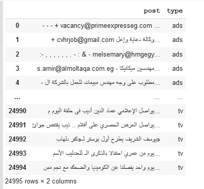

# Project Title

post classifier using Bag of words technique to classify posts in social media network into lots of categories

like political,economic, etc

---

[image1]: ./images/Captureautomata.PNG "Data Image "


### Table of Contents

In this section you will know More bout this interesting project :smiley:

- [overview](#overview)
- [Prerequisites](#Prerequisites)
- [Installing](#Installing)
- [steps of this project](#steps_of_this_project)
- [Running the tests](#Running_the_tests)
- [Deployment](#Deployment)
- [Built With](#Built_With)
- [Contributing](#Contributing)
- [Versioning](#Versioning)
- [Authors](#Authors)
- [License](#License)


---

## overview


 
---
### Prerequisites

* basic acknowledge about Naive Bayes Theorem
* python 
* numpy and pandas
* basic acknowledge Bag of Words
* scikit-learn

---

### Installing

 you should install some libraries to use it in data processing and build model 

```
   import pandas as pd
   import codecs
   import string
   from sklearn.model_selection import train_test_split

   
```

---

### steps of this project

* Understanding our dataset
* Data Preprocessing
* Bag of words
* Implementing Bag of Words in scikit-learn
* Training and testing sets
* Naive Bayes implementation using scikit-learn
* Evaluating our model

---

### Understanding our dataset 

We will be using a dataset originally compiled and posted on the Machine Learning website search has a very good collection of datasets for experimental research purposes. If you're interested, you can review the abstract and the original data file on the wep site.

<p align="center">
  
</p>


---
### Data Preprocessing

Now that we have a basic understanding of what our dataset looks like, lets convert our labels to binary variables, 0 to represent 

'ham'(i.e. not spam) and 1 to represent 'spam' for ease of computation.

You might be wondering why do we need to do this step? The answer to this lies in how scikit-learn handles inputs. Scikit-learn only 

deals with numerical values and hence if we were to leave our label values as strings, scikit-learn would do the conversion 

internally(more specifically, the string labels will be cast to unknown float values).

Our model would still be able to make predictions if we left our labels as strings but we could have issues later when calculating 

performance metrics, for example when calculating our precision and recall scores. Hence, to avoid unexpected 'gotchas' later, it is 

good practice to have our categorical values be fed into our model as integers. 

---
### Bag of words

What we have here in our data set is a large collection of text data (5,572 rows of data). Most ML algorithms rely on numerical data to

be fed into them as input, and email/sms messages are usually text heavy.

Here we'd like to introduce the Bag of Words(BoW) concept which is a term used to specify the problems that have a 'bag of words' or

a collection of text data that needs to be worked with. The basic idea of BoW is to take a piece of text and count the frequency of the 

words in that text. It is important to note that the BoW concept treats each word individually and the order in which the words occur 

does not matter.

Using a process which we will go through now, we can covert a collection of documents to a matrix, with each document being a row and 

each word(token) being the column, and the corresponding (row,column) values being the frequency of occurrance of each word or token in 

that document.

### steps of Bag of words

* Convert all strings to their lower case form.
```
documents = ['Hello, how are you!',
             'Win money, win from home.',
             'Call me now.',
             'Hello, Call hello you tomorrow?']

lower_case_documents = []
for i in documents:
    lower_case_documents.append(i.lower())
print(lower_case_documents)

```
* Removing all punctuation

Remove all punctuation from the strings in the document set. Save them into a list called 'sans_punctuation_documents'.

```
sans_punctuation_documents = []
import string

for i in lower_case_documents:
    sans_punctuation_documents.append(i.translate(str.maketrans('', '', string.punctuation)))
print(sans_punctuation_documents)

```
* Tokenization
Tokenizing a sentence in a document set means splitting up a sentence into individual words using a delimiter. The delimiter specifies

what character we will use to identify the beginning and the end of a word(for example we could use a single space as the delimiter for

identifying words in our document set

```
preprocessed_documents = []
for i in sans_punctuation_documents:
    preprocessed_documents.append(i.split(' '))
print(preprocessed_documents)

```

* Count frequencies

Now that we have our document set in the required format, we can proceed to counting the occurrence of each word in each document of 

the document set. We will use the Counter method from the Python collections library for this purpose.

Counter counts the occurrence of each item in the list and returns a dictionary with the key as the item being counted and the 

corresponding value being the count of that item in the list. 

```
for i in preprocessed_documents:
    frequency_counts = Counter(i)
    frequency_list.append(frequency_counts)
pprint.pprint(frequency_list)

```

*


---

### Implementing Bag of Words in scikit-learn

---

### Training and testing sets

---

### Naive Bayes implementation using scikit-learn

---

### Evaluating our model

---

### Running the tests


---


### Deployment

Add additional notes about how to deploy this on a live system

---

### Built With

* [Dropwizard](http://www.dropwizard.io/1.0.2/docs/) - The web framework used
* [Maven](https://maven.apache.org/) - Dependency Management
* [ROME](https://rometools.github.io/rome/) - Used to generate RSS Feeds

---

### Contributing

Please read [CONTRIBUTING.md](https://gist.github.com/PurpleBooth/b24679402957c63ec426) for details on our code of conduct, and the process for submitting pull requests to us.

---

## Versioning

We use [SemVer](http://semver.org/) for versioning. For the versions available, see the [tags on this repository](https://github.com/your/project/tags). 

---

## Authors

* **Billie Thompson** - *Initial work* - [PurpleBooth](https://github.com/PurpleBooth)

See also the list of [contributors](https://github.com/your/project/contributors) who participated in this project.

---

## License

This project is licensed under the MIT License - see the [LICENSE.md](LICENSE.md) file for details

---


